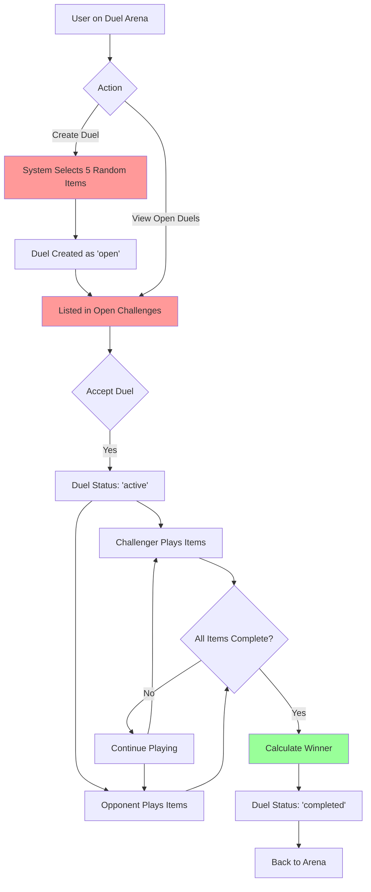
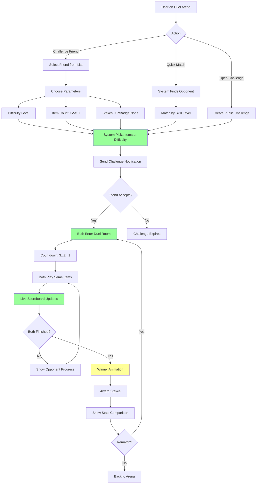

# Duel System - Complete Flow Analysis

## 🤔 Critical Questions

### 1. What's the actual user experience we want?
**Current Implementation:**
- User creates duel → System picks 5 random items → User plays them one by one

**Problems:**
- ❌ No matchmaking - just random open challenges
- ❌ No real-time feel - async only
- ❌ Items are random - no skill-based selection
- ❌ No stakes or rewards
- ❌ No rematch or challenge specific users easily

**What we SHOULD have:**
- ✅ Challenge specific friends
- ✅ Skill-based item selection (same difficulty for both)
- ✅ Clear stakes (XP, badges, bragging rights)
- ✅ Rematch option
- ✅ Duel history and stats

### 2. Is the flow intuitive?
**Current Flow:**
```
Arena → Create Duel → Wait for opponent → Play items → See winner
```

**Issues:**
- No clear indication of what happens after creation
- No notification when opponent accepts
- No way to invite specific users
- No preview of what items will be

**Better Flow:**
```
Arena → Challenge Friend/Open Challenge → 
Set Parameters (difficulty, item count, stakes) →
Opponent Accepts → Both Play → Live Scoreboard → Winner Declared →
Rematch Option
```

### 3. Are we solving the right problem?
**Goal:** Make learning competitive and engaging

**Current Implementation:**
- ✅ Competitive scoring
- ✅ Async play (good for different timezones)
- ❌ No social aspect (can't easily challenge friends)
- ❌ No progression (no ranking, no seasons)
- ❌ No rewards (just bragging rights)

**Missing:**
- Duel ranking/ELO
- Seasons/tournaments
- Rewards system
- Social features (chat, taunts, emojis)
- Spectator mode

---

## 📊 Current Flow Diagram



### Issues in Current Flow:
1. **Random Item Selection** (red) - No skill matching
2. **No Matchmaking** (red) - Just open challenges
3. **No Notifications** - Players don't know when opponent accepts
4. **No Live Updates** - Can't see opponent progress in real-time
5. **No Rematch** - Have to create new duel manually

---

## 🎯 Ideal Flow Diagram



---

## 🔍 Detailed Analysis

### Phase 1: Challenge Creation

**Current:**
```typescript
createDuel({ itemCount: 5 })
// - No opponent specified
// - Random items
// - No parameters
```

**Should Be:**
```typescript
createDuel({
  opponentId?: Id<"users">,        // Specific challenge
  difficulty: "matched" | "easy" | "hard",
  itemCount: 3 | 5 | 10,
  stakes: {
    type: "xp" | "badge" | "ranking",
    amount: number
  },
  timeLimit?: number,               // Optional time pressure
  mode: "standard" | "sudden_death" | "best_of_3"
})
```

### Phase 2: Matchmaking

**Current:**
- ❌ No matchmaking
- ❌ Just open challenges list
- ❌ No skill-based pairing

**Should Have:**
```typescript
// Quick match
findOpponent({
  userId: Id<"users">,
  skillRange: number,              // ±100 Elo
  preferredDifficulty: string
})

// Friend challenge
challengeFriend({
  friendId: Id<"users">,
  notification: true
})
```

### Phase 3: Gameplay

**Current:**
```typescript
// Sequential item display
// Simple text input
// Basic scoring
```

**Should Have:**
```typescript
// Real-time updates
subscribeToOpponentProgress(duelId)

// Better item rendering
renderPracticeItem(item, {
  showTimer: true,
  showOpponentStatus: true,
  allowSkip: false
})

// Rich scoring
calculateScore({
  correctness: boolean,
  timeBonus: number,
  streakBonus: number,
  difficultyMultiplier: number
})
```

### Phase 4: Completion

**Current:**
```typescript
// Simple winner determination
// Navigate back to arena
```

**Should Have:**
```typescript
// Victory screen
showVictoryScreen({
  winner: User,
  finalScores: { challenger: number, opponent: number },
  statsComparison: {
    accuracy: [number, number],
    avgTime: [number, number],
    streak: [number, number]
  },
  rewards: Reward[],
  shareCard: ShareCard
})

// Rematch option
offerRematch({
  sameItems: boolean,
  reverseRoles: boolean
})
```

---

## 🚨 Critical Issues

### 1. Item Selection is Broken
**Problem:** Random items = unfair duels
- Player A gets easy items
- Player B gets hard items
- Not a fair competition!

**Fix:**
```typescript
// Select items at user's skill level
const userElo = await getUserAverageElo(userId);
const items = await pickItemsNearElo(userElo, count);
```

### 2. No Social Features
**Problem:** Can't easily challenge friends
- No friend list integration
- No notifications
- No chat/emotes

**Fix:**
- Add friend system
- Add push notifications
- Add quick reactions (GG, 🔥, 💪)

### 3. No Progression System
**Problem:** No reason to keep playing duels
- No ranking
- No seasons
- No rewards

**Fix:**
```typescript
// Duel ranking
userDuelStats: {
  ranking: number,
  tier: "Bronze" | "Silver" | "Gold" | "Platinum",
  seasonWins: number,
  winStreak: number
}

// Season rewards
seasonRewards: {
  topPlayers: Reward[],
  milestones: { wins: number, reward: Reward }[]
}
```

### 4. No Real-Time Feel
**Problem:** Feels disconnected
- Can't see opponent playing
- No live updates
- No tension/excitement

**Fix:**
- WebSocket for live updates
- Show opponent's current item
- Live scoreboard
- Countdown timers

### 5. Poor Item Display
**Problem:** Just shows item ID
- Not engaging
- Doesn't show actual content
- No context

**Fix:**
- Render actual practice item
- Show item type (MC, prompt, etc.)
- Rich media support
- Progress indicators

---

## ✅ What's Good

1. **Async Play** - Good for different timezones
2. **Score Tracking** - Works correctly
3. **Attempt Validation** - Prevents cheating (can't answer twice)
4. **Expiration** - Duels don't stay open forever
5. **Database Structure** - Schema is solid

---

## 🎯 Recommended Fixes (Priority Order)

### 🔴 Critical (Do Now)
1. **Fix Item Selection**
   - Use adaptive engine to pick fair items
   - Match difficulty to user skill level
   - Ensure both players get same items

2. **Add Friend Challenges**
   - User selector/search
   - Direct challenge button
   - Notification system

3. **Improve Item Display**
   - Render actual practice item content
   - Show item type and context
   - Better UI/UX

### 🟡 Important (Do Soon)
4. **Add Duel Parameters**
   - Difficulty selection
   - Item count options
   - Stakes/rewards

5. **Better Completion Flow**
   - Victory screen with stats
   - Rematch option
   - Share card generation

6. **Live Updates**
   - Opponent progress indicator
   - Real-time scoreboard
   - Notifications

### 🟢 Nice to Have (Do Later)
7. **Ranking System**
   - Duel ELO
   - Tiers/leagues
   - Leaderboards

8. **Seasons**
   - Themed competitions
   - Season rewards
   - Reset mechanics

9. **Social Features**
   - Chat/emotes
   - Spectator mode
   - Replay system

---

## 📝 Proposed New Flow

### Step 1: Challenge Creation
```typescript
// User clicks "Challenge Friend"
<FriendSelector onSelect={friendId => {
  setOpponent(friendId);
  setStep("parameters");
}} />

// User sets parameters
<DuelParameters
  difficulty={difficulty}
  itemCount={itemCount}
  stakes={stakes}
  onConfirm={createChallenge}
/>
```

### Step 2: Acceptance
```typescript
// Friend receives notification
<Notification>
  {challenger.name} challenged you to a duel!
  Difficulty: {difficulty}
  Items: {itemCount}
  Stakes: {stakes}
  <Button onClick={acceptDuel}>Accept</Button>
  <Button onClick={declineDuel}>Decline</Button>
</Notification>
```

### Step 3: Gameplay
```typescript
// Both enter duel room
<DuelRoom>
  <Scoreboard
    challengerScore={score1}
    opponentScore={score2}
    challengerProgress={progress1}
    opponentProgress={progress2}
  />
  
  <ItemDisplay
    item={currentItem}
    onSubmit={handleSubmit}
    showTimer={true}
  />
  
  <OpponentStatus
    currentItem={opponentItem}
    isAnswering={opponentAnswering}
  />
</DuelRoom>
```

### Step 4: Completion
```typescript
// Victory screen
<VictoryScreen>
  <WinnerAnnouncement winner={winner} />
  <StatsComparison
    accuracy={[acc1, acc2]}
    avgTime={[time1, time2]}
  />
  <RewardsDisplay rewards={rewards} />
  <Actions>
    <Button onClick={rematch}>Rematch</Button>
    <Button onClick={share}>Share Result</Button>
    <Button onClick={backToArena}>Back to Arena</Button>
  </Actions>
</VictoryScreen>
```

---

## 🎮 User Stories

### Story 1: Challenge a Friend
```
As a user,
I want to challenge my friend to a duel,
So that we can compete and see who's better.

Acceptance Criteria:
- Can search for friends
- Can select difficulty and parameters
- Friend receives notification
- Can start duel when friend accepts
```

### Story 2: Quick Match
```
As a user,
I want to find an opponent quickly,
So that I can practice competitively without waiting.

Acceptance Criteria:
- System finds opponent at my skill level
- Match starts within 30 seconds
- Items are fair for both players
```

### Story 3: Track Progress
```
As a user,
I want to see my duel ranking and stats,
So that I can track my improvement.

Acceptance Criteria:
- Can see win/loss record
- Can see ranking/tier
- Can see season progress
- Can compare with friends
```

---

## 🔧 Implementation Plan

### Week 1: Fix Critical Issues
- [ ] Implement skill-based item selection
- [ ] Add friend challenge UI
- [ ] Improve item display
- [ ] Add duel parameters

### Week 2: Enhance Experience
- [ ] Add victory screen
- [ ] Implement rematch
- [ ] Add notifications
- [ ] Live progress updates

### Week 3: Add Progression
- [ ] Duel ranking system
- [ ] Leaderboards
- [ ] Season framework
- [ ] Rewards integration

---

## 💡 Key Insights

1. **Current system is MVP** - Works but not engaging
2. **Missing social layer** - Duels should be social
3. **No progression** - Need ranking/seasons
4. **Item selection is critical** - Must be fair
5. **Real-time feel matters** - Even if async

**Bottom Line:** The foundation is solid, but we need to add the "game" to the game mechanics!
