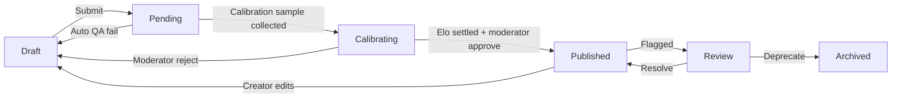

# Creator Studio Spec (Beta)

This spec defines the first release of the Creator Studio that allows TrainingX users to author, remix, and publish Practice Zone activities while preserving quality.

## Goals

1. Make it trivial to remix core projects or fill templated forms to create new practice content.
2. Enforce clarity, safety, and calibration rules before anything goes public.
3. Provide feedback loops and incentives that motivate creators without overwhelming moderators.

## Personas

| Persona | Needs | Example Actions |
| --- | --- | --- |
| **Learner-Creator** | Wants to customize content for their industry or team. | Fork an existing project, tweak scenarios, share privately. |
| **Expert Contributor** | Wants to publish new tracks/modules. | Use Template Fill or From Scratch to submit new items. |
| **Moderator/Staff** | Needs to approve/reject quickly, track calibration. | Review queue, run calibration kicks, resolve flags. |

## Primary Flows

### 1. Entry Screen

* CTA buttons: **Remix Existing**, **Template Fill**, **From Scratch**.
* Display creator stats (published items, adoption, rating).
* Show “Learn how to author” link to documentation.

### 2. Remix Flow

1. User picks a source Project or Item (search + filters).
2. Studio clones metadata into a sandbox draft.
3. User edits steps/scenarios/params, sees diff vs source.
4. Validation runs live; warnings highlight missing pieces.
5. Submit for calibration → enters queue as `status = "pending"`.

### 3. Template Fill Flow

1. User selects template type (MC, Prompt Draft, Prompt Surgery, Tool Selection, Drag/Sort).
2. A multi-step form collects required parameters (scenario shell, target skills, tone, distractors, rubric hints).
3. Auto-generation helpers: “Generate sample distractors,” “Draft explanation,” “Suggest improvements.”
4. Preview panel shows final learner experience and rubric scoring rubric.
5. When all validation passes, user can save draft or submit to calibration.

### 4. From Scratch Flow

* Starts with blank YAML editor (with schema hints) or a dual-pane IDE (form + raw JSON).
* Sidebar lists required fields by item type.
* Live linting using AJV (JSON schema) + custom clarity checks.
* Must attach to an existing Track/Project or create a new draft project.

## Screen Blueprint

### Main Editor Layout

```
┌──────────────────────────────────────────────────────────┐
│ Top Bar: Breadcrumb · Status Chip · Auto-save indicator   │
├───────────────┬───────────────────────────┬───────────────┤
│ Structure     │ Canvas / Form             │ Preview       │
│ (Accordion)   │ - For MC: question,        │ - Learner UI  │
│ - Metadata    │   options table, tags      │   rendering   │
│ - Steps       │ - For draft: scaffold +    │ - AI feedback │
│ - Scenarios   │   rubric weights           │   sample      │
│ - Validation  │ - For project: step list   │               │
├───────────────┴───────────────────────────┴───────────────┤
│ Bottom Bar: Save Draft · Submit for Review · Delete Draft │
└──────────────────────────────────────────────────────────┘
```

*Validation panel* lists blocking errors (red) and advisories (yellow). Hover reveals fix tips.

## Validation Rules

| Rule | Applies To | Check |
| --- | --- | --- |
| **Clarity** | All items | Must include audience, goal, constraints if prompt-related; >120 chars unless MC. |
| **Skill Tagging** | All items | At least one skill tag; maximum five. |
| **Distractor Quality** | MC | Require `good/almost/bad` mix; each needs explanation with temptation reason. |
| **Rubric Coverage** | Drafting | Must set weights that sum to `maxScore`; include improvement tips. |
| **Scenario Link** | Project steps | Each step must point to scenario or inline context. |
| **Safety** | All | Block disallowed content (PII, hate); run quick filter + manual flag option. |
| **Length** | Free-text prompts | Provide target length hints (tokens/words). |
| **Calibration Ready** | Submitted items | Needs pilot difficulty guess (foundation/core/challenge). |
| **Remix Attribution** | Remix | Must retain link to source; display to moderators. |

## Draft Lifecycle



* Auto QA runs on submit; failing rules send draft back with inline comments.
* Calibration requires ≥50 learner attempts (`practiceCalibrationRuns`) with standard error `< 0.1`. Until then content is private.
* Moderators can fast-track staff-authored content by marking calibration as satisfied manually.

## Permissions & Roles

* **Learner-Creator**: create drafts, submit, edit own drafts, see calibration progress.
* **Moderator**: all of the above + approve/reject, edit metadata, view flags, manage seasons.
* **Admin**: schema edits, delete content, override calibration.

## Notifications

* Draft saved → none (auto-save).
* Submission accepted → “QA pending” toast + email summary.
* QA fail → inline errors + email recap.
* Published → email + push (if opted-in) with metrics.
* Remix adoption → weekly digest showing how often their variant was played.

## Analytics

Track per draft: time-to-publish, QA fail reasons, calibration attempts needed, play volume, learner rating.

Track per creator: total published items, adoption %, average rating, remix count.

## Technical Hooks

* GraphQL-like API (Convex mutations/queries) for drafts, QA checks, calibration status.
* Validation service running Node pipeline: AJV schema, custom clarity heuristics, OpenAI moderation if needed.
* Preview uses same React components as learner experience with `previewMode` flag.
* Calibration job uses Elo updates in `practiceCalibrationRuns`.

## Future Enhancements (post-beta)

* Collaborative editing (real-time presence).
* Template marketplace with ratings.
* Prompt auto-improvement suggestions using AI pair author.
* Batch import/export for educators.

